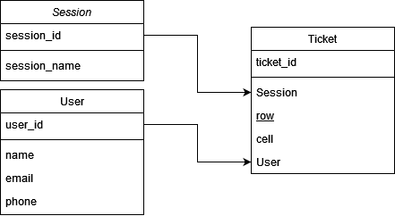
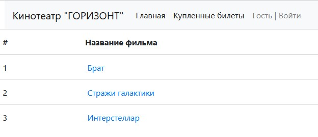
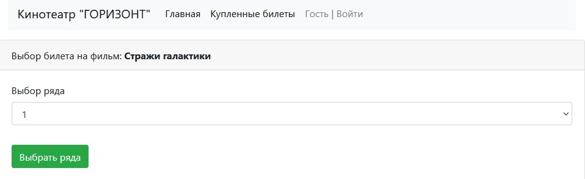
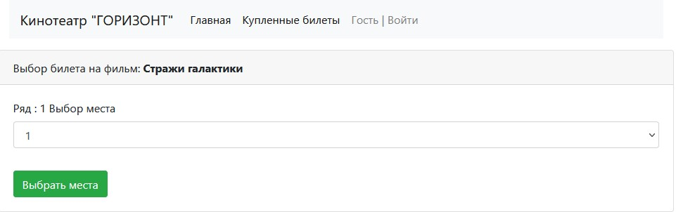
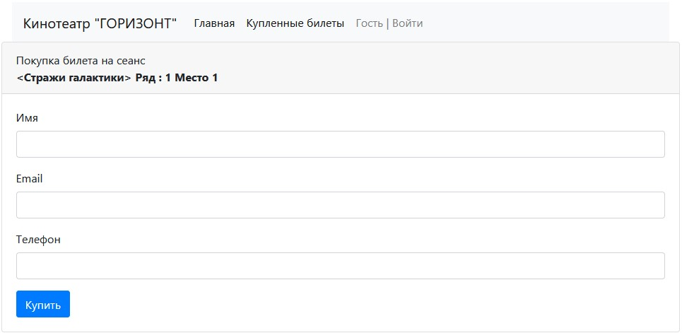
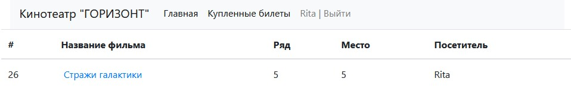
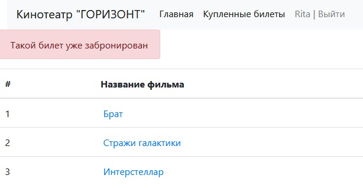
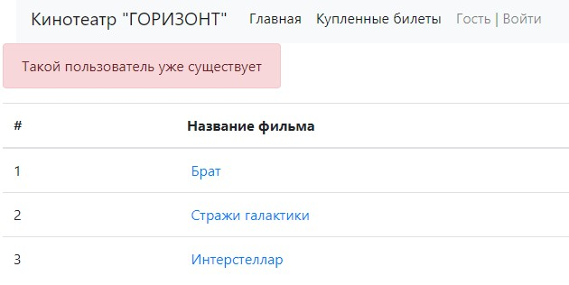

14.04.2024  
<a href=https://github.com/Dima-Stepanov>My github</a>

3. Мидл

3.2.9. Контрольные вопросы

2. Сервис - Кинотеатр [#504869]

<h2>Сервис осуществляет бронирование мест в кинотеатре.</h2>

**Описание реализации проекта Job4j_cinema** 
В проекте реализована слоеная архитектура.  В проекте использовать Spring boot, Thymeleaf, Bootstrap, JDBC 

1. В пакете MODEL реализованы модели данных: Session, Ticket, User 
  
 
   Данные модели так же отражены в SQL скриптах для реализации таблиц в базе данных cinema_db. 
3. В пакете persistence находятся классы который работают с базой данных и организуют CRUD методы для работы с данными
   моделей Session, Ticket, User. SessionDBStore класс реализует CRUD методы с моделью Session в таблице sessions
   UserDBStore класс реализует CRUD методы с моделью User в таблице users TicketDBStore CRUD методы с моделью Ticket в
   таблице ticket. SQL скрипты находятся в пакете db\scripts. 
4. В пакете service расположены классы которые реализуют бизнес логику приложения, а именно обрабатывают методы классов
   из пакета persistence. Классы SessionService и UserSrvice пробрасывают методы из классов пакета persistence
   соответствующих классов. Класс TicketService организует дополнительно вычисление свободных мест на сеанс в кинотеатр. 
5. В пакете controller расположены класс для работы с клиентам а именно обработки запросов GET и POS видов из пакета
   resurces\templates. Класс SessionController отображает вид index.html, при помощи запроса GET отображаются список
   всех сеансов из таблицы session. Класс UserController отображает виды user.html, login.html и обрабатывает запросы
   get и pos для авторизации и добавлении пользователя. Класс TicketController отображает виды allTicket.html,
   ticketRow.html, ticketCell.html. Тут обрабатывается get и pos запросы для выборов сеанса фильма, выбор ряда и места в
   кинозале, а так же отображение купленных билетов. 
6. Виды из пакета resurces\templates созданы с помощью стилей Bootstrap, и запросов шаблонов Thymeleaf. Робота
   приложения. При запуске приложения и переходе на страницу http://localhost:8080 отображается главная страница
   кинотеатра. На ней отражается название кинотеатра и элементы меню сервиса. Меню состоит из следующих ссылок:
   «Главная», «Купленные билеты», и ссылки авторизации «Гость|Войти» данные ссылки меняются в зависимости от
   авторизованного пользователя. 

<h3>Главная страница рисунок 1.</h3>
На главной странице отображается все фильмы, которые есть в прокате. Добавление удаление фильмов не предусмотрено и
инициализацию сеансов производим вместе с созданием схемы базы данных, путем добавлении данных в таблицу Session. Список
сеансов является активными ссылками при нажатии на один из фильмов осуществляется переход на следующую страницу где
предлагается выбрать ряд в кинозале. 

 
Рисунок 1 главная страница.
<h3> Страница выбора ряда рисунок 2 </h3>
При выборе фильма осуществляется переход на страницу выбора ряда. Отображается название выбранный фильма и предложение
выбрать ряд из выпадающего списка. Основное меню отражается как на предыдущей странице. После выбора из выпадающего
списка номера ряда и нажатии кнопки «Выбор ряда» осуществляется переход на страницу выбора места. 

 
Рисунок 2 выбор ряда в кинозале.

<h3>Страница выбора места рисунок 3</h3>
На странице выбора места отображается основное меню в неизменном виде.
Так же отображается Название фильма и ряд выбранные в предыдущих меню.
Выбор места осуществляется раскрытием выпадающего списка и нажатием кнопки выбор места.
После осуществляется переход на страницу ввода персональных данных для бронирование билета. 

 
Рисунок 3 выбор места в кинозале.

<h3>Страница покупка билета на сеанс рисунок 4</h3>
На странице выбора места отображается основное меню в неизменном виде.
Так же отображаются поля для ввода данных пользователя.
После ввода данных и нажатии кнопки купить происходить бронирование билета на данного пользователя. И осуществляется переход на страницу «Купленные билеты». Так же после нажатии кнопки купить пользователь становится авторизованным и в меню авторизации отображается имя пользователя вместо «Гость», а кнопка «Войти» меняется на «Выйти». При этом отображаются билеты принадлежащие только авторизованному пользователю. Рисунок 5.
Если до нажатия кнопки купить билет был уже куплен то осуществляется переход на главную страницу с отображение надписи что билет уже куплен. Рисунок 6. 
Если Email или Телефон уже зарегистрированы в системе по отдельности то система сообщит об ошибки что такой пользователь уже существует при этом бронирование билета не произойдет и пользователь пере направится на главную страницу. Рисунок 7 

 
Рисунок 4 покупка билета на сеанс.

 
Рисунок 5 купленные билеты.

 
Рисунок 6 билет забронирован.

 
Рисунок 7 пользователь существует.